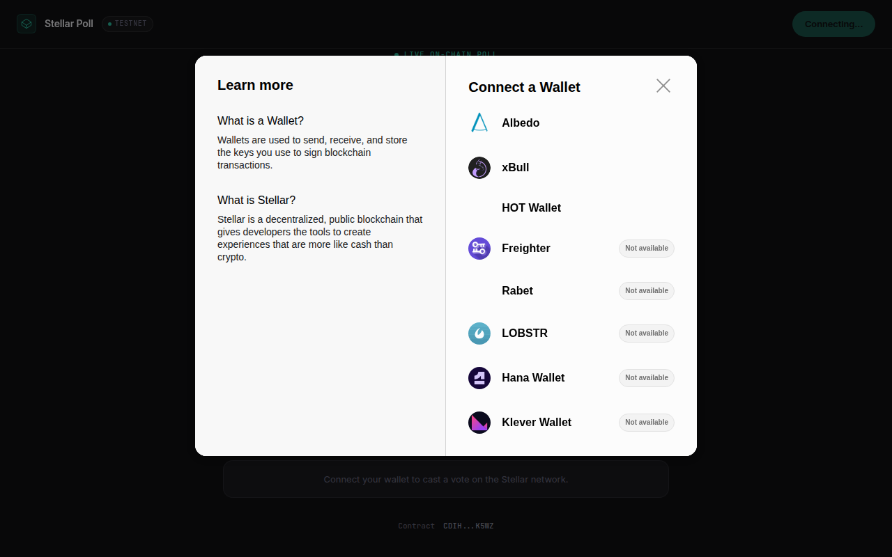

# Stellar Live Poll

A real-time voting dApp built on Stellar/Soroban testnet. Users connect a Stellar wallet, cast a vote, and see tallies update live as other participants vote.

Built for Level 2 of the Stellar/Soroban builder program.

## Live Demo

> **URL:** https://level-2-iota.vercel.app

## Screenshot



## Deployed Contract

- **Network:** Stellar Testnet
- **Contract ID:** `CDIH3FZMQSMD36LJO6KNYNWCXABE5LV7CC3DQC7C26VEYRBSRQPHK5WZ`
- **View on Stellar Expert:** https://stellar.expert/explorer/testnet/contract/CDIH3FZMQSMD36LJO6KNYNWCXABE5LV7CC3DQC7C26VEYRBSRQPHK5WZ

## Sample Transaction

- **Transaction Hash:** `63cab9fc7e997d9232bfb2af4ef7f57195cad144ad21f67a2bcb611d560edd22`
- **View on Stellar Expert:** https://stellar.expert/explorer/testnet/tx/63cab9fc7e997d9232bfb2af4ef7f57195cad144ad21f67a2bcb611d560edd22

## Features

- Multi-wallet support via StellarWalletsKit (Freighter, xBull, Albedo)
- Real-time vote tallies updated via Soroban event polling
- Full transaction lifecycle tracking (pending, success, fail)
- Graceful error handling for: wallet not found, rejected connection, insufficient balance, already voted

## Prerequisites

- Node.js 18+
- A Stellar wallet browser extension (Freighter recommended, or use Albedo for no-install)

Optional (only needed if you want to modify the contract):
- Rust toolchain with `wasm32-unknown-unknown` target
- Stellar CLI (`stellar`)

## Setup

1. Clone the repository:

```bash
git clone https://github.com/alxxrzfyr/stellar-poll.git
cd stellar-live-poll
```

2. Install frontend dependencies:

```bash
npm install
```

3. Copy the environment file and fill in your deployed contract ID:

```bash
cp .env.example .env
```

4. Run the dev server:

```bash
npm run dev
```

## Contract Deployment

The pre-compiled `.wasm` is committed at `contracts/poll/wasm/stellar_poll.wasm`, so you do not need Rust or the Stellar CLI. Deploy entirely with Node.js:

```bash
node scripts/deploy-js.mjs
```

This will:
1. Generate a new testnet keypair and fund it via Friendbot
2. Upload the wasm bytecode to the network
3. Deploy a contract instance
4. Initialize the poll with a sample question and 4 options
5. Print the contract ID for your `.env` file

To reuse an existing funded key, set `DEPLOYER_SECRET`:

```bash
DEPLOYER_SECRET=S... node scripts/deploy-js.mjs
```

If you want to rebuild the contract from source (optional):

1. Install Rust and add the wasm target:

```bash
rustup target add wasm32-unknown-unknown
```

2. Build:

```bash
cd contracts/poll
cargo build --release --target wasm32-unknown-unknown
```

3. Deploy with the fresh build:

```bash
node scripts/deploy-js.mjs contracts/poll/target/wasm32-unknown-unknown/release/stellar_poll.wasm
```

## Build for Production

```bash
npm run build
```

Deploy the `dist/` folder to Vercel, Netlify, or any static host.

## Tech Stack

- **Frontend:** React, TypeScript, Vite
- **Wallet:** @creit.tech/stellar-wallets-kit
- **Blockchain SDK:** @stellar/stellar-sdk
- **Smart Contract:** Soroban (Rust)
- **Network:** Stellar Testnet

## Project Structure

```
├── contracts/poll/       # Soroban smart contract (Rust)
│   └── src/lib.rs
├── scripts/              # Deploy and init scripts
├── src/
│   ├── components/       # React UI components
│   ├── contract/         # Soroban RPC client wrapper
│   ├── hooks/            # React hooks (useVote)
│   ├── wallet/           # StellarWalletsKit provider and UI
│   ├── config.ts         # Environment config constants
│   ├── types.ts          # TypeScript type definitions
│   └── App.tsx           # Root component
├── .env.example
└── package.json
```

## Error Handling

| Error | Trigger | User Message |
|-------|---------|-------------|
| Wallet not found | Extension not installed | "Wallet extension not found. Install Freighter or use Albedo." |
| Rejected connection | User cancels wallet popup | "Connection cancelled. Click Connect Wallet to try again." |
| Insufficient balance | Account has no XLM | "Your testnet account has no XLM. Fund it with Friendbot." |
| Already voted | Same address votes twice | "You have already voted on this poll." |
| Rejected signing | User cancels tx approval | "Transaction signing was cancelled. You can try again." |
